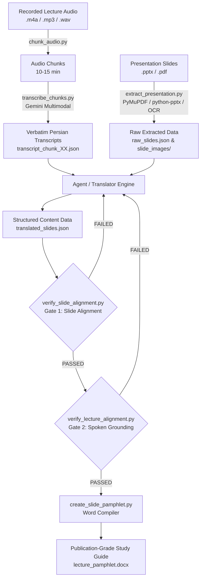

# 🩺 Medical Lecture Transcriber & Study Guide Generator (v5.1.0)

[🇬🇧 English](README.md) | [🇮🇷 فارسی](README_FA.md)

[](tests/)
[](https://python.org)
[](scripts/version.py)
[](LICENSE)
[](https://antigravity.google)

A publication-grade, automated pair-programming and document generation pipeline for medical academia. It converts recorded university medical lectures (audio/video) and English presentation slides (`.pptx` / `.pdf`) into beautifully formatted, tri-partite Microsoft Word study guides (`.docx`) governed by strict clinical accuracy gates, semantic provenance attribution, and visual fidelity protocols.

---

## 🌟 Key Innovations & Architectural Pillars

### 1. 🎯 Tri-Partite Source Provenance (خاستگاه‌شناسی سه‌گانه مطالب)
Students must immediately know the origin of every statement:
* **Track 1 (`[🎙️ تدریس کلاسی استاد]`):** Captures 100% of the professor's spoken clinical nuances, diagnostic mnemonics, laboratory thresholds, drug dosages, and patient case anecdotes. Zero parametric hallucination.
* **Track 2 (`[📑 ترجمه اسلاید X]`):** Dedicated light blue slide box (`#85C1E9`) featuring literal, faithful Persian translations of English slide bullets.
* **Track 3 (`[💡 شرح تکمیلی رفرنس]`):** High-yield reference commentary (Harrison, Cecil, Braunwald, etc.) in royal purple callouts (`#6C3483`) strictly outside Track 2 for unvoiced, skipped, or dense slides.

### 2. 🛡️ Anti-Clause Parentheses Gate (`PARENTHETICAL_CLAUSE_VIOLATION`)
Prevents translation shortcuts and visual pollution:
* English terms in translated slide bullets are strictly restricted to concise proper nouns, drug names, and domain acronyms (maximum 1–4 words, e.g., `(Duodenum)`, `(Corrected calcium)`, `(Cinacalcet)`, `(PTH)`).
* Copy-pasting full English clauses or sentences with verbs/conjunctions triggers an immediate hard validation error.

### 3. 🔬 Substantive Concept Denominator Filtering
* Filters routine English academic prose verbs and fillers (`cannot`, `provide`, `enough`, `replace`, `losses`, `under`, `circumstances`, `directed`) from recall denominators.
* Evaluates true clinical entities, formulas, chemical notations (`Ca²⁺`, `HCO₃⁻`), measurements, and acronyms, allowing fluent academic Persian translation to pass 100% cleanly without artificial English token crutches.

### 4. ☁️ Gemini Multimodal Audio Transcription Protocol
* Native in-context audio comprehension leveraging Google Gemini multimodal capabilities.
* Strictly prohibits heavy local Whisper/CUDA downloads, saving gigabytes of disk space and GPU memory while preserving exact Persian medical pronunciation.

### 5. 👁️ Visual-Aware OCR & Confidence Thresholding
* Intelligently triggers OCR for slides containing images, micrographs, charts, smart art, or tables, regardless of digital text volume.
* Filters OCR noise using statistical confidence thresholds (`mean_conf >= 0.60`, substantive tokens $\ge 2$).
* Displays warning banners in Word documents if embedded image extraction fails.

### 6. 🧪 103-Test Automated Quality Suite
* Comprehensive unit, integration, and adversarial tests ensuring page index invariance, zero content drift, chronological audio grounding, and schema integrity.

---

## 🏗️ Architecture & Pipeline Flow



---

## 📂 Repository Structure

```text
medical-lecture-transcriber/
├── scripts/
│   ├── annotate_docx.py            # Word XML margin annotator & reference callouts
│   ├── chunk_audio.py              # Lossless silence-aware audio chunker
│   ├── create_slide_pamphlet.py    # Master DOCX study guide compiler
│   ├── extract_presentation.py     # Presentation extractor with visual-aware OCR
│   ├── package_skill.py            # POSIX-compliant clean packager & plugin syncer
│   ├── run_pipeline.py             # Unified CLI orchestrator
│   ├── text_utils.py               # Medical tokenization & bilingual concept engine
│   ├── transcribe_chunks.py        # Lightweight Gemini cloud STT client
│   ├── verify_lecture_alignment.py # Temporal monotonicity & audio grounding gate
│   ├── verify_slide_alignment.py   # Page index invariance & concept recall gate
│   └── version.py                  # Canonical single source of truth version
├── tests/
│   ├── conftest.py                 # Pytest fixtures and mock environments
│   ├── test_drift.py               # Slide index invariance & drift regression tests
│   ├── test_extractor_and_ocr.py   # Visual-aware OCR & presentation extractor tests
│   ├── test_gates.py               # Alignment, recall, and parenthetical clause gate tests
│   ├── test_normalization.py       # Persian digit & text normalization tests
│   └── test_pipeline_and_tools.py  # CLI and STT protocol tests
├── .gitignore
├── LICENSE                         # MIT License
├── plugin.json                     # Antigravity plugin manifest
├── pyproject.toml                  # Python packaging & dependencies
├── README.md                       # Repository documentation
└── SKILL.md                        # Master Antigravity Agent Skill specification
```

---

## 🚀 Quick Start & CLI Usage

### Prerequisites
* Python 3.11+
* [uv](https://docs.astral.sh/uv/) (recommended) or standard `pip`

```bash
# Clone the repository
git clone https://github.com/<your-username>/medical-lecture-transcriber.git
cd medical-lecture-transcriber

# Install dependencies and run tests
uv run pytest
```

### Running Pipeline Commands

The pipeline is managed via `scripts/run_pipeline.py`:

```bash
# 1. Chunk audio into manageable 10-minute segments
uv run python scripts/run_pipeline.py chunk --input lecture.m4a --output-dir chunks/

# 2. Extract presentation slides and images (with auto OCR)
uv run python scripts/run_pipeline.py extract --input presentation.pptx --output raw_slides.json --images-dir slide_images/

# 3. Transcribe audio chunks with Gemini Multimodal API
uv run python scripts/run_pipeline.py transcribe --audio-dir chunks/ --output transcripts/ --model gemini-2.0-flash

# 4. Verify slide translation alignment & concept recall
uv run python scripts/run_pipeline.py verify-slides --raw raw_slides.json --translated translated_slides.json

# 5. Verify spoken lecture coverage & chronological order
uv run python scripts/run_pipeline.py verify-lecture --translated translated_slides.json --chunks-dir chunks/

# 6. Compile the final publication Word document
uv run python scripts/run_pipeline.py build --translated translated_slides.json --output lecture_pamphlet.docx --ref-book هاریسون --verify
```

---

## 🎨 Typography & Word Styling Palette

All Microsoft Word documents (`.docx`) generated by this tool follow strict institutional medical typography:

| Component | Font | Size | Weight | Color (HEX) | Purpose |
| :--- | :--- | :--- | :--- | :--- | :--- |
| **Document Title** | Dubai | 16pt | Bold | `#78281F` (Burgundy) | Title header |
| **Section Heading (H1)** | Dubai | 14pt | Bold | `#78281F` (Burgundy) | Chapter / Topic divisions |
| **Timestamp Tag** | Dubai | 10pt | Bold | `#D35400` (Deep Orange) | Audio position tag `[⏱️ زمان: XX:YY]` |
| **Subheadings (H2)** | Dubai | 11pt | Bold | `#0E6251` (Forest Emerald) | Clinical sub-topics |
| **Body Paragraphs** | Dubai | 11pt | Regular | `#262626` (Charcoal) | Professor lecture monologue |
| **Slide Box Header** | Dubai | 10.5pt | Bold | `#1B4F72` on `#EBF5FB` | Slide banner `📑 اسلاید مرتبط X` |
| **Slide Box Border** | - | 1pt | - | `#85C1E9` (Sky Blue) | Clean structural outline |
| **Ref Note Header** | Dubai | 10pt | Bold | `#6C3483` (Royal Purple) | Textbook clarification banner |
| **Student Review** | Dubai | 10.5pt | Bold | `#D35400` on `#FEF9E7` | Amber advisory badge |

---

## 🧪 Testing

To run the full suite of **103 automated tests**:

```bash
uv run pytest -v
```

All 103 tests pass in under 3 seconds with zero external network calls.

---

## 📄 License

This project is licensed under the **MIT License** - see the [LICENSE](LICENSE) file for details.
