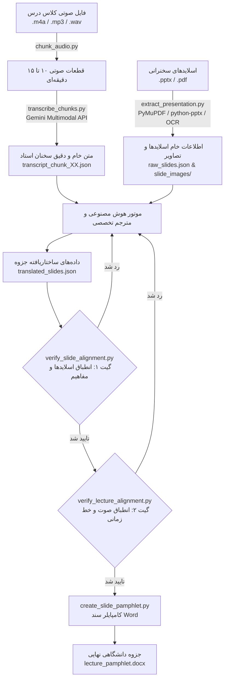

# 🩺 سامانه هوشمند پیاده‌سازی صوت و تدوین جزوات پزشکی (نسخه ۵.۱.۰)

[🇬🇧 English](README.md) | [🇮🇷 فارسی](README_FA.md)

[](https://github.com/HunterHill13/medical-lecture-transcriber/actions)
[](tests/)
[](https://python.org)
[](scripts/version.py)
[](LICENSE)
[](https://antigravity.google)

یک خط لوله (Pipeline) خودکار، استاندارد و در سطح انتشار کتاب و جزوه دانشگاهی برای علوم پزشکی. این سامانه صدا و فیلم ضبط‌شده کلاس‌های درس پزشکی را به همراه اسلایدهای انگلیسی ارائه (`.pptx` یا `.pdf`) به یک **جزوه جامع Microsoft Word (`.docx`)** با استانداردهای دقیق دقت بالینی، خاستگاه‌شناسی سه‌گانه، گیت‌های سخت‌گیرانه عدم سوگیری و حفظ وفاداری دیداری تبدیل می‌کند.

---

## 🌟 ارکان و نوآوری‌های کلیدی سامانه

### ۱. 🎯 خاستگاه‌شناسی سه‌گانه مطالب (Tri-Partite Source Provenance)
دانشجو باید در نگاه اول دقیقاً بداند هر مطلب از کجا آمده است:
* **ترک ۱ (`[🎙️ تدریس کلاسی استاد]`):** پوشش ۱۰۰٪ نکات بیانی استاد، کیس‌های بالینی معرفی‌شده، اعداد و آستانه‌های آزمایشگاهی، دوز داروها و نکات تشخیصی شفاهی بدون حتی یک کلمه توهم یا افزودن ناخواسته.
* **ترک ۲ (`[📑 ترجمه اسلاید X]`):** کادر اختصاصی آبی ملایم (`#85C1E9`) شامل ترجمه دقیق و وفادارانه بولت‌های انگلیسی اسلاید.
* **ترک ۳ (`[💡 شرح تکمیلی رفرنس]`):** کادر بنفش اختصاصی (`#6C3483`) در خارج از جدول اسلاید برای اسلایدهایی که استاد سریع از آن‌ها رد شده یا نیاز به شرح تکمیلی رفرنس‌های معتبر (هاریسون، سیسیل، برانوالد و ...) دارند.

### ۲. 🛡️ گیت منع درج عبارات انگلیسی در پرانتز (`PARENTHETICAL_CLAUSE_VIOLATION`)
جلوگیری قطعی از تنبلی مترجم و کپی‌پیست جملات انگلیسی:
* کلمات انگلیسی در متن ترجمه اسلاید اکیداً به **اسامی خاص پزشکی، نام اختصاصی داروها و سرواژه‌ها (حداکثر ۱ تا ۴ کلمه)** نظیر `(Duodenum)` یا `(Cinacalcet)` محدود است.
* قرار دادن جملات کامل انگلیسی با فعل یا حرف ربط در پرانتز بلافاصله خط لوله را متوقف کرده و خطای سخت صادر می‌کند.

### ۳. 🔬 پالایش توکن‌های ماهوی از مخرج کسر یادآوری (Substantive Concept Filtering)
* افعال و کلمات روتین نگارش انگلیسی نظیر `cannot`، `provide`، `replace`، `under` از مخرج کسر ارزیابی حذف می‌شوند.
* تمرکز ارزیابی تنها روی مفاهیم تخصصی بالینی، فرمول‌ها، نمادهای بیوشیمیایی (`Ca²⁺`، `HCO₃⁻`) و مخفف‌های پزشکی است تا ترجمه فارسی بتواند بدون نیاز به واژه‌های زائد انگلیسی، با پایبندی ۱۰۰٪ تایید شود.

### ۴. ☁️ پروتکل رونویسی صوتی چندوجهی جمنای (Gemini Multimodal STT)
* بهره‌گیری مستقیم از قابلیت چندوجهی Google Gemini برای درک زبان گفتاری و تبدیل گفتار به نوشتار.
* ممنوعیت اکید دانلود مدل‌های سنگین لوکال ویسپر (Whisper) و بسته‌های حجیم CUDA؛ حفظ گیگابایت‌ها فضای دیسک و حافظه با دقت بی‌نظیر در واژگان تخصصی فارسی-انگلیسی پزشکی.

### ۵. 👁️ موتور OCR آگاه به محتوای بصری اسلایدها
* فعال‌سازی هوشمند OCR برای اسلایدهایی که دارای تصویر، نمودار، جدول یا SmartArt هستند، حتی اگر اسلاید متن دیجیتال زیادی داشته باشد.
* پالایش خطاهای OCR با آستانه اطمینان آماری (`confidence >= 0.60`).
* ثبت بنر هشدار در سند Word در صورت بروز هرگونه خطا در استخراج تصاویر اسلایدها.

### ۶. 🧪 مجموعه آزمون‌های خودکار ۱۰۳ تستی
* شامل آزمون‌های جامع یکپارچگی، عدم جابه‌جایی صفحات اسلایدها، خط زمانی صوتی و صحت ساختار داده‌ها.

---

## 🏗️ جریان کاری و دیاگرام خط لوله (Architecture Pipeline)



---

## 📂 ساختار فایل‌ها و مخزن

```text
medical-lecture-transcriber/
├── .github/workflows/
│   └── ci.yml                      # اکشن گیت‌هاب جهت تست خودکار CI
├── scripts/
│   ├── annotate_docx.py            # حاشیه‌نویسی اسناد Word و کادرهای رفرنس
│   ├── chunk_audio.py              # قطعه‌بندی بدون اتلاف صوت در نقاط سکوت
│   ├── create_slide_pamphlet.py    # کامپایلر اصلی ساخت جزوه رسمی Word (.docx)
│   ├── extract_presentation.py     # استخراج‌کننده اسلایدها و OCR هوشمند
│   ├── package_skill.py            # بسته‌بندی تمیز اسکیل مطابق استاندارد POSIX
│   ├── run_pipeline.py             # ارکستراتور و خط فرمان یکپارچه CLI
│   ├── text_utils.py               # موتور تطبیق مفاهیم دوزبانه پزشکی
│   ├── transcribe_chunks.py        # کلاینت ابری چندوجهی جمنای
│   ├── verify_lecture_alignment.py # گیت انطباق زمانی و پوشش صدای استاد
│   ├── verify_slide_alignment.py   # گیت انطباق شماره اسلایدها و ارزیابی مفاهیم
│   └── version.py                  # مرجع واحد نسخه برنامه
├── tests/
│   ├── conftest.py                 # فیکسچرها و محیط تست
│   ├── test_drift.py               # آزمون‌های عدم جابه‌جایی اسلایدها
│   ├── test_extractor_and_ocr.py   # آزمون‌های استخراج و OCR
│   ├── test_gates.py               # آزمون‌های گیت‌های اعتبارسنجی
│   ├── test_normalization.py       # آزمون‌های نرمال‌سازی اعداد و متون فارسی
│   └── test_pipeline_and_tools.py  # آزمون‌های خط فرمان و ارتباطات ابری
├── .gitignore
├── LICENSE                         # مجوز انتشار MIT
├── plugin.json                     # مانیفست پلاگین آنتی‌گرویتی
├── pyproject.toml                  # تعاریف پکیج پایتون و نیازمندی‌ها
├── README.md                       # مستندات انگلیسی
├── README_FA.md                    # مستندات کامل فارسی
└── SKILL.md                        # سند راهنمای اسکیل آنتی‌گرویتی
```

---

## 🚀 راهنمای سریع و اجرای دستورات (CLI Usage)

### پیش‌نیازها
* پایتون ۳.۱۱ یا بالاتر
* مدیر بسته [uv](https://docs.astral.sh/uv/) (پیشنهادی) یا `pip`

```bash
# دریافت مخزن
git clone https://github.com/HunterHill13/medical-lecture-transcriber.git
cd medical-lecture-transcriber

# نصب نیازمندی‌ها و اجرای آزمون‌ها
uv run pytest
```

### اجرای خط لوله گام به گام

خط لوله توسط فایل `scripts/run_pipeline.py` هدایت می‌شود:

```bash
# ۱. خرد کردن صوت طولانی به قطعات ۱۰ دقیقه‌ای
uv run python scripts/run_pipeline.py chunk --input lecture.m4a --output-dir chunks/

# ۲. استخراج متون، تصاویر و اجرای OCR اسلایدها
uv run python scripts/run_pipeline.py extract --input presentation.pptx --output raw_slides.json --images-dir slide_images/

# ۳. پیاده‌سازی صوت قطعات با جمنای
uv run python scripts/run_pipeline.py transcribe --audio-dir chunks/ --output transcripts/ --model gemini-2.0-flash

# ۴. بررسی انطباق و گیت ترجمه اسلایدها
uv run python scripts/run_pipeline.py verify-slides --raw raw_slides.json --translated translated_slides.json

# ۵. بررسی انطباق زمانی و پوشش صدای استاد
uv run python scripts/run_pipeline.py verify-lecture --translated translated_slides.json --chunks-dir chunks/

# ۶. تولید سند نهایی Word با قالب استاندارد
uv run python scripts/run_pipeline.py build --translated translated_slides.json --output lecture_pamphlet.docx --ref-book هاریسون --verify
```

---

## 🎨 پالت رنگی و استانداردهای تایپوگرافی Word

تمامی اسناد خروجی طبق شیوه مصوب دانشگاهی با فونت Dubai و ساختار راست‌به‌چپ (RTL) طراحی می‌شوند:

| بخش سند | قلم (فونت) | سایز | وزن | کد رنگ | کاربرد |
| :--- | :--- | :--- | :--- | :--- | :--- |
| **عنوان جزوه** | Dubai | ۱۶ پوینت | Bold | `#78281F` (زرشکی) | سربرگ اصلی سند |
| **تیتر اصلی (H1)** | Dubai | ۱۴ پوینت | Bold | `#78281F` (زرشکی) | تفکیک مباحث و فصول |
| **برچسب زمان** | Dubai | ۱۰ پوینت | Bold | `#D35400` (نارنجی تیره) | نشانگر زمانی صوت `[⏱️ زمان: XX:YY]` |
| **زیرعنوان (H2)** | Dubai | ۱۱ پوینت | Bold | `#0E6251` (سبز یشمی) | زیرمباحث بالینی |
| **متن تدریس استاد** | Dubai | ۱۱ پوینت | Regular | `#262626` (زغالی تیره) | بیانات کلاسی استاد |
| **کادر اسلاید** | Dubai | ۱۰.۵ پوینت | Bold | `#1B4F72` در `#EBF5FB` | کادر ترجمه اسلاید |
| **حاشیه اسلاید** | - | ۱ پوینت | - | `#85C1E9` (آبی روشن) | کادر دور جدول اسلاید |
| **کادر رفرنس** | Dubai | ۱۰ پوینت | Bold | `#6C3483` (بنفش شاهی) | کادر توضیحات کتاب مرجع |
| **نیاز به بازبینی** | Dubai | ۱۰.۵ پوینت | Bold | `#D35400` در `#FEF9E7` | هشدار موارد نیازمند بررسی دانشجو |

---

## 🧪 اجرای آزمون‌ها

برای اطمینان از صحت تمام بخش‌ها، مجموعه **۱۰۳ تست خودکار** بدون نیاز به اتصال به اینترنت در کمتر از ۵ ثانیه اجرا می‌شوند:

```bash
uv run pytest -v
```

---

## 📄 مجوز انتشار (License)

این پروژه تحت مجوز آزاد [MIT License](LICENSE) منتشر شده است.
