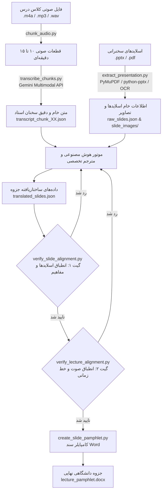

# 🩺 سامانه هوشمند پیاده‌سازی صوت و تدوین جزوات پزشکی (نسخه ۵.۷.۰)

[🇬🇧 English](README.md) | [🇮🇷 فارسی](README_FA.md)

[](https://github.com/HunterHill13/medical-lecture-transcriber/actions)
[](tests/)
[](https://python.org)
[](scripts/version.py)
[](LICENSE)
[](https://antigravity.google)

یک خط لوله (Pipeline) خودکار، استاندارد و در سطح انتشار کتاب و جزوه دانشگاهی برای علوم پزشکی. این سامانه صدا و فیلم ضبط‌شده کلاس‌های درس پزشکی را به همراه اسلایدهای انگلیسی ارائه (`.pptx` یا `.pdf`) به یک **جزوه جامع Microsoft Word (`.docx`)** با استانداردهای دقیق دقت بالینی، خاستگاه‌شناسی سه‌گانه، گیت‌های سخت‌گیرانه عدم سوگیری و حفظ وفاداری دیداری تبدیل می‌کند.

---

## 🌟 ارکان و نوآوری‌های کلیدی سامانه

### ۱. 🎯 خاستگاه‌شناسی سه‌گانه مطالب (Tri-Partite Source Provenance)
دانشجو باید در نگاه اول دقیقاً بداند هر مطلب از کجا آمده است:
* **ترک ۱ (`[🎙️ تدریس کلاسی استاد]`):** پوشش ۱۰۰٪ نکات بیانی استاد، کیس‌های بالینی معرفی‌شده، اعداد و آستانه‌های آزمایشگاهی، دوز داروها و نکات تشخیصی شفاهی بدون حتی یک کلمه توهم یا افزودن ناخواسته.
* **ترک ۲ (`[📑 ترجمه اسلاید X]`):** کادر اختصاصی آبی ملایم (`#85C1E9`) شامل ترجمه دقیق و وفادارانه بولت‌های انگلیسی اسلاید.
* **ترک ۳ (`[💡 شرح تکمیلی رفرنس]`):** کادر بنفش اختصاصی (`#6C3483`) در خارج از جدول اسلاید برای اسلایدهایی که استاد سریع از آن‌ها رد شده یا نیاز به شرح تکمیلی رفرنس‌های معتبر (هاریسون، سیسیل، برانوالد و ...) دارند.

### ۲. 🛡️ گیت منع درج عبارات انگلیسی در پرانتز (`PARENTHETICAL_CLAUSE_VIOLATION`)
جلوگیری قطعی از تنبلی مترجم و کپی‌پیست جملات انگلیسی:
* کلمات انگلیسی در متن ترجمه اسلاید اکیداً به **اسامی خاص پزشکی، نام اختصاصی داروها و سرواژه‌ها (حداکثر ۱ تا ۴ کلمه)** نظیر `(Duodenum)` یا `(Cinacalcet)` محدود است.
* قرار دادن جملات کامل انگلیسی با فعل یا حرف ربط در پرانتز بلافاصله خط لوله را متوقف کرده و خطای سخت صادر می‌کند.

### ۳. 🔬 پالایش توکن‌های ماهوی از مخرج کسر یادآوری و واژه‌نامه تخصصی
* افعال و کلمات روتین نگارش انگلیسی نظیر `cannot`، `provide`، `replace`، `under` از مخرج کسر ارزیابی حذف می‌شوند.
* تمرکز ارزیابی تنها روی مفاهیم تخصصی بالینی، فرمول‌ها، نمادهای بیوشیمیایی (`Ca²⁺`، `HCO₃⁻`) و مخفف‌های پزشکی است تا ترجمه فارسی بتواند بدون نیاز به واژه‌های زائد انگلیسی، با پایبندی ۱۰۰٪ تایید شود.
* توسعه واژه‌نامه تخصصی با اصطلاحات پای دیابتی، طبقه‌بندی واگنر، وسایل ارتوپدی (`aircast walker`)، چربی خون و الگوهای محافظت ارگان‌های هدف.

### ۴. 📊 گیت ممیزی تمامیت و عدم حذف ردیف‌های جداول (`TABLE_COMPLETENESS_GATE`)
* الزام قطعی به ترجمه سطر به سطر و اتمیک ۱۰۰٪ ردیف‌ها و سرفصل‌های فرعی در جداول رفرنس درسی (نظیر جدول هاریسون).
* شناسایی هوشمند اسکرین‌شات‌ها و تصاویر حاوی جدول و راهنماهای بالینی (`has_image_table: true`) حتی در صورت وجود نویز در OCR.
* گنجاندن متون کلیه خانه‌های جدول در موتور یادآوری مفاهیم و صدور خطای سخت مسدودکننده (`INCOMPLETE_TABLE_TRANSCRIPTION` و `MISSING_TABLE_DATA`) در صورت خلاصه کردن یا جا انداختن ردیف‌های جدول.

### ۵. 🛑 گیت منع توهم ردیف در جداول (`UNGROUNDED_TABLE_ROW_CONTENT`)
* پایش سطر به سطر جداول تولیدشده و تطبیق آن با محتوای اسلاید خام و OCR.
* جلوگیری از توهم حافظه پارامتریک و اضافه کردن سرخود ردیف‌ها، گریدها یا دسته‌بندی‌هایی که در اسلاید اصلی وجود ندارند (نظیر افزودن گرید ۰ به جدولی که فقط گریدهای ۱ تا ۵ را دارد).

### ۶. 🛑 گیت منع درج عبارات انگلیسی در متن فارسی بولت‌ها (`UNPROCESSED_ENGLISH_CLAUSE_VIOLATION`)
* ممیزی دقیق متون فارسی بولت‌ها خارج از پرانتز برای شناسایی عبارات و جملات انگلیسی دست‌نخورده (۴ کلمه یا بیشتر با علائم جمله‌بندی یا ۵ توکن متوالی انگلیسی).
* مسدودسازی ترفند دور زدن ارزیابی از طریق رهاسازی انگلیسی خام در متن فارسی بدون ترجمه.

### ۷. 🔄 ارث‌بری خودکار فراداده‌های بصری و ساختاری اسلایدها
* کامپایلر ارشد فایل ورد (`create_slide_pamphlet.py`) به طور خودکار یا از طریق آرگومان `--raw` متادیتای بصری (`has_images`، `has_charts`، `has_tables`، `has_image_table`، `is_visual`، `img_path`) را از `raw_slides.json` به ارث می‌برد.
* تضمین قطعی درج تمام نگاره‌های بالینی، پاتولوژی، نمونه‌های بیماری، وسایل پزشکی و منحنی‌ها در فایل ورد حتی اگر در فایل ترجمه فراموش شده باشند.
* درج بنر اخطار ساختاری هوشمند (`⚠️ تذکر ساختاری: اسلاید اصلی حاوی جدول است...`) در جزوه در صورت غفلت از استخراج ساختار داده‌ای جدول.

### ۸. ☁️ پروتکل رونویسی صوتی چندوجهی جمنای (Gemini Multimodal STT)
* بهره‌گیری مستقیم از قابلیت چندوجهی Google Gemini برای درک زبان گفتاری و تبدیل گفتار به نوشتار.
* ممنوعیت اکید دانلود مدل‌های سنگین لوکال ویسپر (Whisper) و بسته‌های حجیم CUDA؛ حفظ گیگابایت‌ها فضای دیسک و حافظه با دقت بی‌نظیر در واژگان تخصصی فارسی-انگلیسی پزشکی.

### ۹. 👁️ موتور OCR آگاه به محتوای بصری اسلایدها
* فعال‌سازی هوشمند OCR برای اسلایدهایی که دارای تصویر، نمودار، جدول یا SmartArt هستند، حتی اگر اسلاید متن دیجیتال زیادی داشته باشد.
* پالایش خطاهای OCR با آستانه اطمینان آماری (`confidence >= 0.60`).
* ثبت بنر هشدار در سند Word در صورت بروز هرگونه خطا در استخراج تصاویر اسلایدها.

### ۱۰. 📈 موتور همگانی رندرسازی برداری نمودارها و تصاویر متای ویندوز (`convert_image_to_png`)
* تبدیل خودکار و بلادرنگ انواع فرمت‌های برداری و تخصصی نظیر WMF، EMF، SVG، WebP و TIFF به PNG استاندارد با وضوح بالا، هم در مرحله استخراج اسلاید و هم در مرحله کامپایل سند Word.
* جستجوی پویای الگوهای نام‌گذاری فایل‌های نگاره با تابع `find_and_prepare_slide_image` و رفع وابستگی شکننده به نام‌های ثابت.
* پیاده‌سازی گیت `VISUAL_ASSET_AUDIT` برای نظارت بر وجود فیزیکی تصاویر نمودارها در کنار بنر آموزشی هوشمند در فایل Word در صورت فقدان تصویر نمودار.

### ۱۱. 🛡️ موتور پالایش خودکار یادداشت‌های رفرنس و منع تکرار دوگانه تیتر (`sanitize_ref_note`)
* حذف قطعی و تضمین‌شده خطای تکرار دوگانه تیتر (Dual Prepending) در مواردی که مدل عبارت «💡 شرح تکمیلی رفرنس...» را درون فیلد `ref_note` در JSON ذخیره می‌کند.
* پیاده‌سازی تحلیل‌گر منعطف رگکس مستقل از نام کتاب مرجع در `text_utils.py` جهت زدودن ایموجی‌ها، نام‌های کتاب (هاریسون، سیسیل و...) و پسوندهای تفهیم مبحث، در عین حفاظت کامل از متن اصیل علمی.
* اتصال مستقیم به گیت اعتبارسنجی `verify_slide_alignment.py` و صدور پیام هشدار ساختاری غیرمسدودکننده (`DUPLICATE_REF_TITLE_PREFIX`) بدون ایجاد وقفه در کامپایل نهایی جزوه.

### ۱۲. 🖼️ موتور هوشمند تفکیک نگاره‌های بالینی و گارد اسلایدهای متنی
* **پالایش چندمعیاره تصاویر استخراج‌شده:** تشخیص و فیلتر خودکار آیکون‌های تزئینی کوچک و بالت‌های گرافیکی (ابعاد کمتر از ۱۵۰ پیکسل یا مساحت کمتر از ۲۵,۰۰۰ پیکسل‌مربع) و پس‌زمینه‌های تم اسلاید مستر (پوشش بیش از ۸۰٪ مساحت اسلاید).
* **استخراج نگاره‌های مستقل بالینی (`slide_NN_fig.png`):** برای اسلایدهای ترکیبی حاوی متن و نمودار/تصویر پزشکی، نگاره واقعی به صورت مستقل استخراج شده و در سند فایل ورد بدون اسکرین‌شات متن انگلیسی اسلاید درج می‌گردد.
* **گارد هوشمند اسکرین‌شات اسلایدهای متنی:** در کامپایلر ورد، اسلایدهایی که صرفاً حاوی بالت‌های متنی ترجمه‌شده هستند از اسکرین‌شات زائد کل اسلاید انگلیسی منع شده و ظاهر جزوه کاملاً تمیز و دانشگاهی حفظ می‌شود.

### ۱۳. 🔢 موتور حفظ داده‌های آماری و عددی اسلایدها و پالایش انکودینگ (`SLIDE_NUMERICAL_DATA_OMISSION`)
* **ترجمه وفادارانه و نامستور ارقام کمّی:** الزام قطعی به حفظ سطر به سطر تمامی نسبت‌های شیوع (نظیر `5 in 10,000` یا `3 in 10,000`)، درصدهای آماری (`0.5–2%` یا `2–5%`)، بازه‌ها، سنین کوهورت و دوزهای درمانی در ترجمه بولت‌های اسلاید؛ بدون حق تبدیل داده‌های آماری به گزاره‌های کیفی و کلی (مانند «شیوع بالاست»).
* **اصل عدم نشست و مصادره محتوا بین ترک‌ها (Anti-Track Leakage):** توضیح مبسوط آمار توسط استاد در ویس (Track 1) هرگز مجوزی برای حذف یا خلاصه کردن اعداد در کادر ترجمه اسلاید (Track 2) نیست.
* **پالایش خودکار انکودینگ و کاراکترهای مخدوش (`sanitize_presentation_text`):** تبدیل هوشمند کاراکترهای خراب (مانند `\ufffd` در بازه‌هایی نظیر `2\ufffd5%` به `2-5%`)، خط تیره‌های یونیکد en-dash و em-dash و گیومه‌های فانتزی در لایه استخراج پاورپوینت و PDF.
* **پالایش مخرج کسر و جلوگیری از دور زدن گیت:** گسترش واژه‌نامه افعال و کلمات عام (`countries`، `origin`، `frequent`، `population`) جهت جلوگیری از اخذ امتیاز پوشش کاذب صرفاً با درج کلمات انگلیسی در پرانتز.

### ۱۴. 🧪 مجموعه آزمون‌های خودکار ۱۲۸ تستی
* شامل آزمون‌های جامع یکپارچگی، عدم جابه‌جایی صفحات اسلایدها، رندرسازی وکتورها، صحت بازتولید ردیف‌های جداول، تشخیص توهمات جدول، مسدودسازی جملات انگلیسی خام، پالایش یادداشت‌های رفرنس، استخراج نگاره‌های مستقل، گارد اسلایدهای متنی، حفظ داده‌های عددی و آماری، خط زمانی صوتی و ساختار داده‌ها.

---

## 🏗️ جریان کاری و دیاگرام خط لوله (Architecture Pipeline)



---

## 📂 ساختار فایل‌ها و مخزن

```text
medical-lecture-transcriber/
├── .github/workflows/
│   └── ci.yml                      # اکشن گیت‌هاب جهت تست خودکار CI
├── scripts/
│   ├── annotate_docx.py            # حاشیه‌نویسی اسناد Word و کادرهای رفرنس
│   ├── chunk_audio.py              # قطعه‌بندی بدون اتلاف صوت در نقاط سکوت
│   ├── create_slide_pamphlet.py    # کامپایلر اصلی ساخت جزوه رسمی Word (.docx)
│   ├── extract_presentation.py     # استخراج‌کننده اسلایدها و OCR هوشمند
│   ├── package_skill.py            # بسته‌بندی تمیز اسکیل مطابق استاندارد POSIX
│   ├── run_pipeline.py             # ارکستراتور و خط فرمان یکپارچه CLI
│   ├── text_utils.py               # موتور تطبیق مفاهیم دوزبانه پزشکی
│   ├── transcribe_chunks.py        # کلاینت ابری چندوجهی جمنای
│   ├── verify_lecture_alignment.py # گیت انطباق زمانی و پوشش صدای استاد
│   ├── verify_slide_alignment.py   # گیت انطباق شماره اسلایدها و ارزیابی مفاهیم
│   └── version.py                  # مرجع واحد نسخه برنامه
├── tests/
│   ├── conftest.py                 # فیکسچرها و محیط تست
│   ├── test_drift.py               # آزمون‌های عدم جابه‌جایی اسلایدها
│   ├── test_extractor_and_ocr.py   # آزمون‌های استخراج و OCR
│   ├── test_gates.py               # آزمون‌های گیت‌های اعتبارسنجی
│   ├── test_normalization.py       # آزمون‌های نرمال‌سازی اعداد و متون فارسی
│   └── test_pipeline_and_tools.py  # آزمون‌های خط فرمان و ارتباطات ابری
├── .gitignore
├── LICENSE                         # مجوز انتشار MIT
├── plugin.json                     # مانیفست پلاگین آنتی‌گرویتی
├── pyproject.toml                  # تعاریف پکیج پایتون و نیازمندی‌ها
├── README.md                       # مستندات انگلیسی
├── README_FA.md                    # مستندات کامل فارسی
└── SKILL.md                        # سند راهنمای اسکیل آنتی‌گرویتی
```

---

## 🚀 راهنمای سریع و اجرای دستورات (CLI Usage)

### پیش‌نیازها
* پایتون ۳.۱۱ یا بالاتر
* مدیر بسته [uv](https://docs.astral.sh/uv/) (پیشنهادی) یا `pip`

```bash
# دریافت مخزن
git clone https://github.com/HunterHill13/medical-lecture-transcriber.git
cd medical-lecture-transcriber

# نصب نیازمندی‌ها و اجرای آزمون‌ها
uv run pytest
```

### اجرای خط لوله گام به گام

خط لوله توسط فایل `scripts/run_pipeline.py` هدایت می‌شود:

```bash
# ۱. خرد کردن صوت طولانی به قطعات ۱۰ دقیقه‌ای
uv run python scripts/run_pipeline.py chunk --input lecture.m4a --output-dir chunks/

# ۲. استخراج متون، تصاویر و اجرای OCR اسلایدها
uv run python scripts/run_pipeline.py extract --input presentation.pptx --output raw_slides.json --images-dir slide_images/

# ۳. پیاده‌سازی صوت قطعات با جمنای
uv run python scripts/run_pipeline.py transcribe --audio-dir chunks/ --output transcripts/ --model gemini-2.0-flash

# ۴. بررسی انطباق و گیت ترجمه اسلایدها
uv run python scripts/run_pipeline.py verify-slides --raw raw_slides.json --translated translated_slides.json

# ۵. بررسی انطباق زمانی و پوشش صدای استاد
uv run python scripts/run_pipeline.py verify-lecture --translated translated_slides.json --chunks-dir chunks/

# ۶. تولید سند نهایی Word با قالب استاندارد
uv run python scripts/run_pipeline.py build --translated translated_slides.json --output lecture_pamphlet.docx --ref-book هاریسون --verify
```

---

## 🎨 پالت رنگی و استانداردهای تایپوگرافی Word

تمامی اسناد خروجی طبق شیوه مصوب دانشگاهی با فونت Dubai و ساختار راست‌به‌چپ (RTL) طراحی می‌شوند:

| بخش سند | قلم (فونت) | سایز | وزن | کد رنگ | کاربرد |
| :--- | :--- | :--- | :--- | :--- | :--- |
| **عنوان جزوه** | Dubai | ۱۶ پوینت | Bold | `#78281F` (زرشکی) | سربرگ اصلی سند |
| **تیتر اصلی (H1)** | Dubai | ۱۴ پوینت | Bold | `#78281F` (زرشکی) | تفکیک مباحث و فصول |
| **برچسب زمان** | Dubai | ۱۰ پوینت | Bold | `#D35400` (نارنجی تیره) | نشانگر زمانی صوت `[⏱️ زمان: XX:YY]` |
| **زیرعنوان (H2)** | Dubai | ۱۱ پوینت | Bold | `#0E6251` (سبز یشمی) | زیرمباحث بالینی |
| **متن تدریس استاد** | Dubai | ۱۱ پوینت | Regular | `#262626` (زغالی تیره) | بیانات کلاسی استاد |
| **کادر اسلاید** | Dubai | ۱۰.۵ پوینت | Bold | `#1B4F72` در `#EBF5FB` | کادر ترجمه اسلاید |
| **حاشیه اسلاید** | - | ۱ پوینت | - | `#85C1E9` (آبی روشن) | کادر دور جدول اسلاید |
| **کادر رفرنس** | Dubai | ۱۰ پوینت | Bold | `#6C3483` (بنفش شاهی) | کادر توضیحات کتاب مرجع |
| **نیاز به بازبینی** | Dubai | ۱۰.۵ پوینت | Bold | `#D35400` در `#FEF9E7` | هشدار موارد نیازمند بررسی دانشجو |

---

## 🧪 اجرای آزمون‌ها

برای اطمینان از صحت تمام بخش‌ها، مجموعه **۱۰۳ تست خودکار** بدون نیاز به اتصال به اینترنت در کمتر از ۵ ثانیه اجرا می‌شوند:

```bash
uv run pytest -v
```

---

## 📄 مجوز انتشار (License)

این پروژه تحت مجوز آزاد [MIT License](LICENSE) منتشر شده است.
